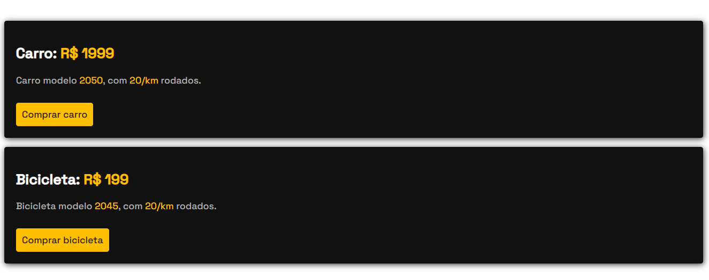

# 1. Layout

### Display CSS

Codificação de interface com ênfase na compreensão da propriedade Display do CSS dos elementos inline, block e inline-block.

Formalmente, a propriedade display define os tipos de exibição internos e externos de um elemento/seletor. Neste código CSS não foi utilizado flex ou grid. 

###

